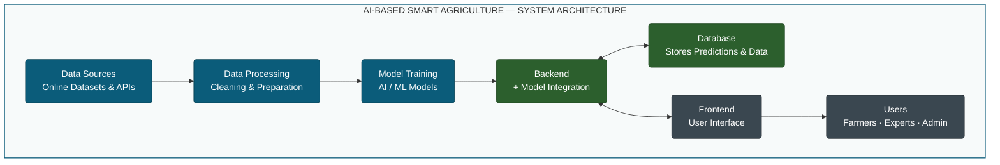

```mermaid
flowchart LR
  subgraph ARCH["AI-BASED SMART AGRICULTURE — SYSTEM ARCHITECTURE"]
    direction LR

    A["Data Sources<br/>Online Datasets & APIs"]
    B["Data Processing<br/>Cleaning & Preparation"]
    C["Model Training<br/>AI / ML Models"]
    D["Backend<br/>+ Model Integration"]
    E["Database<br/>Stores Predictions & Data"]
    F["Frontend<br/>User Interface"]
    G["Users<br/>Farmers · Experts · Admin"]

    A --> B --> C --> D
    D <--> E
    D <--> F
    F --> G
  end

  classDef stage fill:#0B5C7A,color:#fff,stroke:#083F51,stroke-width:1px,rx:4,ry:4;
  classDef core fill:#2C5F2D,color:#fff,stroke:#1F4620,stroke-width:1px,rx:4,ry:4;
  classDef user fill:#3A4750,color:#fff,stroke:#22292E,stroke-width:1px,rx:4,ry:4;
  classDef container fill:#F7FAFA,stroke:#0B5C7A,stroke-width:1.5px;

  class A,B,C stage;
  class D,E core;
  class F user;
  class G user;
  class ARCH container;
```
