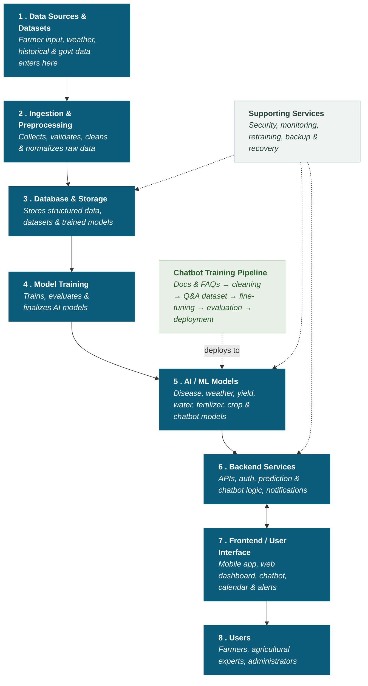

```mermaid
flowchart TD
  A["<b>1 . Data Sources & Datasets</b><br/><i>Farmer input, weather, historical & govt data enters here</i>"]
  B["<b>2 . Ingestion & Preprocessing</b><br/><i>Collects, validates, cleans & normalizes raw data</i>"]
  C["<b>3 . Database & Storage</b><br/><i>Stores structured data, datasets & trained models</i>"]
  D["<b>4 . Model Training</b><br/><i>Trains, evaluates & finalizes AI models</i>"]
  E["<b>5 . AI / ML Models</b><br/><i>Disease, weather, yield, water, fertilizer, crop & chatbot models</i>"]
  F["<b>6 . Backend Services</b><br/><i>APIs, auth, prediction & chatbot logic, notifications</i>"]
  G["<b>7 . Frontend / User Interface</b><br/><i>Mobile app, web dashboard, chatbot, calendar & alerts</i>"]
  H["<b>8 . Users</b><br/><i>Farmers, agricultural experts, administrators</i>"]

  CTP["<b>Chatbot Training Pipeline</b><br/><i>Docs & FAQs → cleaning → Q&A dataset → fine-tuning → evaluation → deployment</i>"]
  SUP["<b>Supporting Services</b><br/><i>Security, monitoring, retraining, backup & recovery</i>"]

  A --> B --> C --> D --> E --> F
  F <--> G
  G --> H

  CTP -.->|deploys to| E
  SUP -.-> C
  SUP -.-> E
  SUP -.-> F

  classDef block fill:#0B5C7A,color:#fff,stroke:#0B5C7A,stroke-width:1px,text-align:left;
  classDef pipeline fill:#E7EFE6,color:#2C5F2D,stroke:#8FA98F,text-align:left;
  classDef support fill:#EFF3F1,color:#26433A,stroke:#8FA3A8,text-align:left;

  class A,B,C,D,E,F,G,H block;
  class CTP pipeline;
  class SUP support;
```
