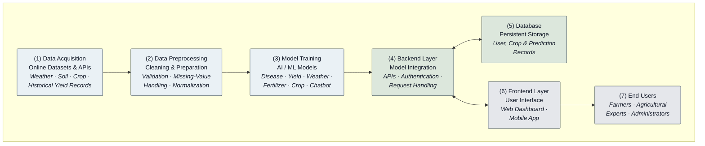

**Fig. 1.** Proposed system architecture. Raw agricultural data — weather, soil, crop, and historical yield records — is acquired from online datasets and APIs (1), then cleaned, validated, and normalized during preprocessing (2). This data trains the core AI/ML models for disease detection, yield estimation, weather forecasting, fertilizer recommendation, crop suitability, and the advisory chatbot (3). The backend layer (4) exposes these models through authenticated APIs, maintaining bidirectional communication with the database (5), which persists user, crop, and prediction records, and with the frontend layer (6), comprising the web dashboard and mobile application. The frontend serves the end users (7) — farmers, agricultural experts, and administrators.
