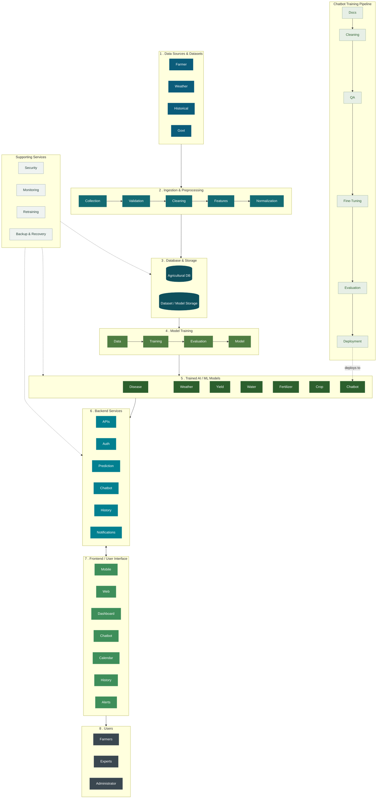

```mermaid
flowchart TD
  subgraph L1["1 . Data Sources & Datasets"]
    direction LR
    A1[Farmer]
    A2[Weather]
    A3[Historical]
    A4[Govt]
  end

  subgraph L2["2 . Ingestion & Preprocessing"]
    direction LR
    B1[Collection] --> B2[Validation] --> B3[Cleaning] --> B4[Features] --> B5[Normalization]
  end

  subgraph L3["3 . Database & Storage"]
    direction LR
    D1[("Agricultural DB")]
    D2[("Dataset / Model Storage")]
  end

  subgraph L4["4 . Model Training"]
    direction LR
    T1[Data] --> T2[Training] --> T3[Evaluation] --> T4[Model]
  end

  subgraph L5["5 . Trained AI / ML Models"]
    direction LR
    M1[Disease]
    M2[Weather]
    M3[Yield]
    M4[Water]
    M5[Fertilizer]
    M6[Crop]
    M7[Chatbot]
  end

  subgraph L6["6 . Backend Services"]
    direction LR
    S1[APIs]
    S2[Auth]
    S3[Prediction]
    S4[Chatbot]
    S5[History]
    S6[Notifications]
  end

  subgraph L7["7 . Frontend / User Interface"]
    direction LR
    F1[Mobile]
    F2[Web]
    F3[Dashboard]
    F4[Chatbot]
    F5[Calendar]
    F6[History]
    F7[Alerts]
  end

  subgraph L8["8 . Users"]
    direction LR
    U1[Farmers]
    U2[Experts]
    U3[Administrator]
  end

  subgraph CTP["Chatbot Training Pipeline"]
    direction LR
    C1[Docs] --> C2[Cleaning] --> C3[QA] --> C4[Fine-Tuning] --> C5[Evaluation] --> C6[Deployment]
  end

  subgraph SUP["Supporting Services"]
    direction LR
    P1[Security]
    P2[Monitoring]
    P3[Retraining]
    P4[Backup & Recovery]
  end

  L1 --> L2 --> L3 --> L4 --> L5 --> L6
  L6 <--> L7
  L7 --> L8

  C6 -.->|deploys to| M7
  SUP -.-> L3
  SUP -.-> L5
  SUP -.-> L6

  classDef data fill:#0B5C7A,color:#fff,stroke:#0B5C7A;
  classDef backend fill:#146B72,color:#fff,stroke:#146B72;
  classDef db fill:#0E4F5C,color:#fff,stroke:#0E4F5C;
  classDef training fill:#4F7D42,color:#fff,stroke:#4F7D42;
  classDef ai fill:#2C5F2D,color:#fff,stroke:#2C5F2D;
  classDef svc fill:#028090,color:#fff,stroke:#028090;
  classDef fe fill:#3E8E5A,color:#fff,stroke:#3E8E5A;
  classDef user fill:#3A4750,color:#fff,stroke:#3A4750;
  classDef pipeline fill:#E7EFE6,color:#2C5F2D,stroke:#8FA98F;
  classDef support fill:#EFF3F1,color:#26433A,stroke:#8FA3A8;

  class A1,A2,A3,A4 data;
  class B1,B2,B3,B4,B5 backend;
  class D1,D2 db;
  class T1,T2,T3,T4 training;
  class M1,M2,M3,M4,M5,M6,M7 ai;
  class S1,S2,S3,S4,S5,S6 svc;
  class F1,F2,F3,F4,F5,F6,F7 fe;
  class U1,U2,U3 user;
  class C1,C2,C3,C4,C5,C6 pipeline;
  class P1,P2,P3,P4 support;
```
