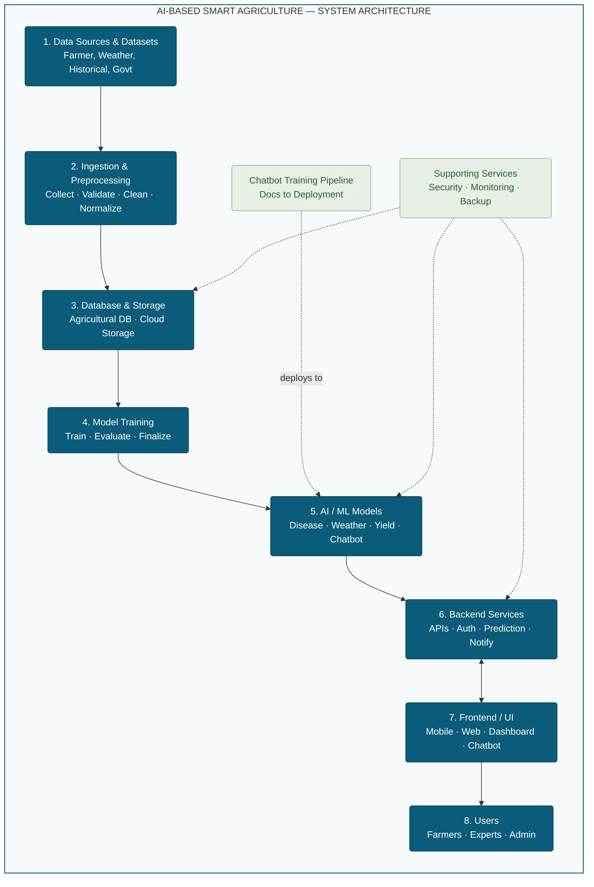

```mermaid
flowchart TD
  subgraph SYS["AI-BASED SMART AGRICULTURE — SYSTEM ARCHITECTURE"]
    direction TB

    A["1. Data Sources & Datasets<br/>Farmer, Weather, Historical, Govt"]
    B["2. Ingestion & Preprocessing<br/>Collect · Validate · Clean · Normalize"]
    C["3. Database & Storage<br/>Agricultural DB · Cloud Storage"]
    D["4. Model Training<br/>Train · Evaluate · Finalize"]
    E["5. AI / ML Models<br/>Disease · Weather · Yield · Chatbot"]
    F["6. Backend Services<br/>APIs · Auth · Prediction · Notify"]
    G["7. Frontend / UI<br/>Mobile · Web · Dashboard · Chatbot"]
    H["8. Users<br/>Farmers · Experts · Admin"]

    A --> B --> C --> D --> E --> F
    F <--> G
    G --> H

    subgraph SIDE[" "]
      direction LR
      CTP["Chatbot Training Pipeline<br/>Docs to Deployment"]
      SUP["Supporting Services<br/>Security · Monitoring · Backup"]
    end

    CTP -.->|deploys to| E
    SUP -.-> C
    SUP -.-> E
    SUP -.-> F
  end

  classDef block fill:#0B5C7A,color:#fff,stroke:#083F51,stroke-width:1px,rx:4,ry:4;
  classDef side fill:#E7EFE6,color:#2C5F2D,stroke:#8FA98F,stroke-width:1px,rx:4,ry:4;
  classDef container fill:#F7FAFA,stroke:#0B5C7A,stroke-width:1.5px;

  class A,B,C,D,E,F,G,H block;
  class CTP,SUP side;
  class SYS container;
  style SIDE fill:none,stroke:none;
```
