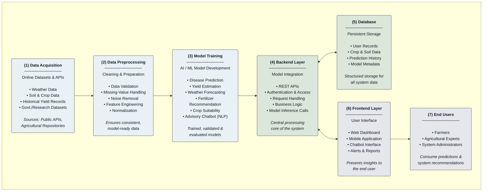

**Fig. 1.** Proposed system architecture. Raw agricultural data — weather, soil, crop, and historical yield records — is acquired from public APIs and research repositories (1), then validated, cleaned, and normalized during preprocessing (2). This data trains the core AI/ML models for disease prediction, yield estimation, weather forecasting, fertilizer recommendation, crop suitability, and the NLP-based advisory chatbot (3). The backend layer (4) exposes these models through authenticated REST APIs and handles all business logic and inference requests, maintaining bidirectional communication with the database (5), which persists user, crop, and prediction records, and with the frontend layer (6), comprising the web dashboard, mobile application, and chatbot interface. The frontend serves the end users (7) — farmers, agricultural experts, and system administrators — who consume the resulting predictions and recommendations.
