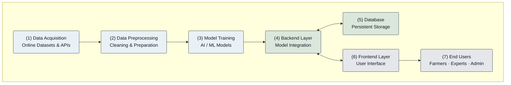

**Fig. 1.** Proposed system architecture. Raw agricultural data is acquired from online datasets and APIs (1), preprocessed (2), and used to train the AI/ML models (3). The backend layer (4) integrates the trained models and maintains bidirectional communication with the database (5) for persistent storage and the frontend layer (6), which serves the end users (7).
