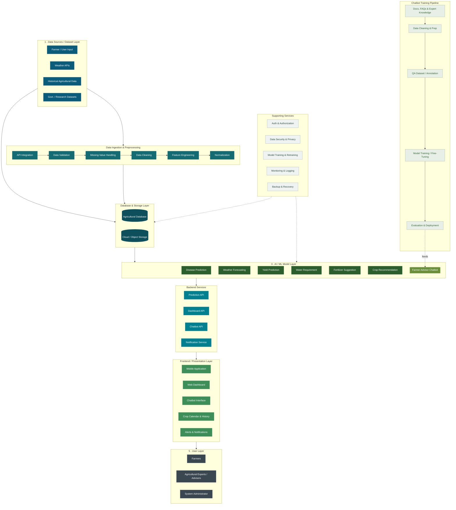

```mermaid
flowchart TD
  subgraph L1["1 . Data Sources / Dataset Layer"]
    A1[Farmer / User Input]
    A2[Weather APIs]
    A3[Historical Agricultural Data]
    A4[Govt. / Research Datasets]
  end

  subgraph L2a["Data Ingestion & Preprocessing"]
    B1[API Integration] --> B2[Data Validation] --> B3[Missing-Value Handling] --> B4[Data Cleaning] --> B5[Feature Engineering] --> B6[Normalization]
  end

  subgraph L2b["Database & Storage Layer"]
    D1[("Agricultural Database")]
    D2[("Cloud / Object Storage")]
  end

  subgraph L3["3 . AI / ML Model Layer"]
    M1[Disease Prediction]
    M2[Weather Forecasting]
    M3[Yield Prediction]
    M4[Water Requirement]
    M5[Fertilizer Suggestion]
    M6[Crop Recommendation]
    M7[["Farmer Advisor Chatbot"]]
  end

  subgraph L3T["Chatbot Training Pipeline"]
    T1[Docs, FAQs & Expert Knowledge] --> T2[Data Cleaning & Prep] --> T3[QA Dataset / Annotation] --> T4[Model Training / Fine-Tuning] --> T5[Evaluation & Deployment]
  end

  subgraph L4a["Backend Services"]
    P1[Prediction API]
    P2[Dashboard API]
    P3[Chatbot API]
    P4[Notification Service]
  end

  subgraph L4b["Frontend / Presentation Layer"]
    F1[Mobile Application]
    F2[Web Dashboard]
    F3[Chatbot Interface]
    F4[Crop Calendar & History]
    F5[Alerts & Notifications]
  end

  subgraph L5["5 . User Layer"]
    U1[Farmers]
    U2[Agricultural Experts / Advisors]
    U3[System Administrator]
  end

  subgraph SS["Supporting Services"]
    S1[Auth & Authorization]
    S2[Data Security & Privacy]
    S3[Model Training & Retraining]
    S4[Monitoring & Logging]
    S5[Backup & Recovery]
  end

  L1 --> L2a
  L1 --> L2b
  L2a --> L2b
  L2b --> L3
  L3 --> L4a
  L4a --> L4b
  L4b --> L5
  T5 -.->|feeds| M7
  SS -.-> L2b
  SS -.-> L3

  classDef data fill:#0B5C7A,color:#fff,stroke:#0B5C7A;
  classDef backend fill:#146B72,color:#fff,stroke:#146B72;
  classDef db fill:#0E4F5C,color:#fff,stroke:#0E4F5C;
  classDef ai fill:#2C5F2D,color:#fff,stroke:#2C5F2D;
  classDef chat fill:#6B8F3B,color:#fff,stroke:#6B8F3B;
  classDef pipeline fill:#E7EFE6,color:#2C5F2D,stroke:#8FA98F;
  classDef api fill:#028090,color:#fff,stroke:#028090;
  classDef fe fill:#3E8E5A,color:#fff,stroke:#3E8E5A;
  classDef user fill:#3A4750,color:#fff,stroke:#3A4750;
  classDef support fill:#EFF3F1,color:#26433A,stroke:#8FA3A8;

  class A1,A2,A3,A4 data;
  class B1,B2,B3,B4,B5,B6 backend;
  class D1,D2 db;
  class M1,M2,M3,M4,M5,M6 ai;
  class M7 chat;
  class T1,T2,T3,T4,T5 pipeline;
  class P1,P2,P3,P4 api;
  class F1,F2,F3,F4,F5 fe;
  class U1,U2,U3 user;
  class S1,S2,S3,S4,S5 support;
```