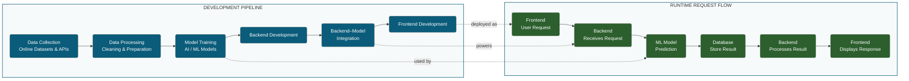

```mermaid
flowchart LR
  subgraph DEV["DEVELOPMENT PIPELINE"]
    direction LR
    D1["Data Collection<br/>Online Datasets & APIs"]
    D2["Data Processing<br/>Cleaning & Preparation"]
    D3["Model Training<br/>AI / ML Models"]
    D4["Backend Development"]
    D5["Backend–Model<br/>Integration"]
    D6["Frontend Development"]

    D1 --> D2 --> D3 --> D4 --> D5 --> D6
  end

  subgraph RUN["RUNTIME REQUEST FLOW"]
    direction LR
    R1["Frontend<br/>User Request"]
    R2["Backend<br/>Receives Request"]
    R3["ML Model<br/>Prediction"]
    R4["Database<br/>Store Result"]
    R5["Backend<br/>Processes Result"]
    R6["Frontend<br/>Displays Response"]

    R1 --> R2 --> R3 --> R4 --> R5 --> R6
  end

  D6 -.->|deployed as| R1
  D5 -.->|powers| R2
  D3 -.->|used by| R3

  classDef dev fill:#0B5C7A,color:#fff,stroke:#083F51,stroke-width:1px,rx:4,ry:4;
  classDef run fill:#2C5F2D,color:#fff,stroke:#1F4620,stroke-width:1px,rx:4,ry:4;
  classDef container fill:#F7FAFA,stroke:#0B5C7A,stroke-width:1.5px;

  class D1,D2,D3,D4,D5,D6 dev;
  class R1,R2,R3,R4,R5,R6 run;
  class DEV,RUN container;
```
